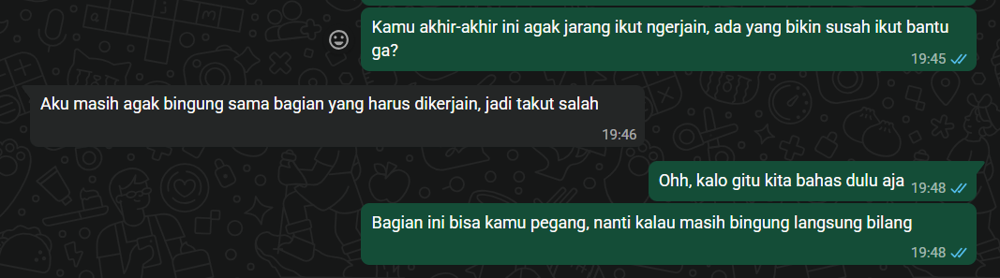

## Kompetensi target

Membedakan person, personality, dan character serta memilih objective, repertoire, dan language yang sesuai.

## Lima character

| Domain dan character | Person & relationship | Objective & responsibility | Repertoire & language | Risiko dan latihan |
|---|---|---|---|---|
| Intra-Self — problem solver | Diri sendiri saat menghadapi tugas atau masalah | Mencari jalan keluar tanpa langsung menyerah atau bergantung pada orang lain | Memahami masalah, mencari beberapa cara, lalu memilih yang paling memungkinkan | Terlalu lama berpikir sebelum mulai; latihan langsung mencoba dari langkah paling sederhana |
| Family — anak pertama yang merantau | Orang tua dan adik yang tinggal jauh saat saya kuliah di luar kota | Tetap dekat dengan keluarga, memberi kabar, dan belajar mengurus diri sendiri | Memberi kabar, cerita tentang keseharian, dan menghubungi keluarga saat membutuhkan bantuan | Terlalu fokus dengan kegiatan sendiri; latihan menyempatkan waktu untuk keluarga |
| Friends — tempat cerita | Teman yang sedang butuh didengarkan atau dimintai pendapat | Membantu teman merasa didengar tanpa mengambil keputusan untuknya | Mendengarkan, bertanya, dan memberi pendapat sesuai kebutuhan teman | Terlalu cepat memberi solusi; latihan memahami masalahnya sebelum memberi saran |
| Work — rekan kerja | Anggota tim dengan cara kerja dan tingkat keaktifan yang berbeda | Menjaga pekerjaan tetap berjalan sekaligus membantu anggota yang mengalami kendala | Check-in personal, diskusi, pembagian tugas, dan follow-up | Langsung menilai orang dari tingkat keaktifannya; mencari tahu kendala sebelum menyimpulkan |
| Community — penggerak kegiatan | Orang-orang yang terlibat dalam organisasi atau kegiatan bersama | Berkontribusi dan mendorong anggota lain untuk ikut terlibat | Mengajak, berdiskusi, menyampaikan ide, dan menyesuaikan diri dengan kondisi kelompok | Terlalu fokus pada hasil; tetap memperhatikan keterlibatan anggota lain |

## Episode yang dianalisis

**Konteks:**  Dalam salah satu kegiatan, ada anggota yang terlihat kurang aktif sehingga beberapa pekerjaan akhirnya kurang terbantu. Awalnya saya menganggap dia kurang berinisiatif. Namun, yang saya tahu hanya bahwa dia jarang mengambil pekerjaan, jadi saya belum bisa memastikan penyebabnya.

**Objective:**  Memahami kendalanya, membuat pekerjaannya kembali berjalan, dan tetap menjaga hubungan kerja di dalam tim.

> **Saya:** “Kamu akhir-akhir ini agak jarang ikut ngerjain, ada yang bikin susah ikut bantu ga?”
> **Anggota**: “Aku masih agak bingung sama bagian yang harus dikerjain, jadi takut salah.”
> **Saya**: “Ohh, kalo gitu kita bahas dulu aja. Bagian ini bisa kamu pegang, nanti kalau masih bingung langsung bilang.”

Setelah mengetahui bahwa masalahnya adalah ketidakjelasan tugas, saya membantu menjelaskan bagian yang perlu dikerjakan dan melakukan follow-up setelahnya. Anggota tersebut kemudian mulai lebih terlibat dan pekerjaan tim kembali berjalan.

## Perubahan language

Sebelum mengetahui kondisinya, sebagai rekan kerja, saya akan berkata, “Kok kamu belum ikut ngerjain?” Setelah mengetahui bahwa ia masih bingung dengan tugasnya, sebagai rekan kerja, saya berkata, “Bagian mana yang masih bikin bingung? Kita bahas dulu.” Cara berkomunikasi saya berubah setelah mendapatkan informasi baru, dari langsung menuntut hasil menjadi mencoba memahami masalah dan membantu mencari jalan keluarnya.

## Evidence, AI, dan feedback

- Evidence: Chat dengan anggota, pembagian tugas, dan perubahan progress pekerjaan sebelum dan setelah dilakukan follow-up.

- AI digunakan untuk membantu memisahkan fakta dari asumsi dalam melihat situasi. Hasil analisis tetap saya cek kembali dengan evidence yang ada dan tidak menggunakan AI sebagai sumber fakta mengenai kondisi anggota.
- Saya sudah mencoba memahami kondisi anggota sebelum mengambil tindakan, tetapi saya seharusnya melakukan check-in lebih awal sebelum pekerjaan mulai tertinggal.
- Next practice: Jika ada anggota yang mulai kurang terlibat, saya akan melakukan check-in lebih awal untuk mengetahui apakah ada kendala sebelum membuat kesimpulan mengenai keaktifannya.

## Self-assessment

| Dimensi | Score | Alasan |
|---|---:|---|
| Person & Character | 4 | Dapat membedakan character berdasarkan peran, hubungan, dan konteks, bukan hanya berdasarkan sifat pribadi. |
| Objective & State | 4 | Kondisi awal, tujuan, serta perubahan setelah mendapatkan informasi baru dapat dijelaskan dengan jelas. |
| Repertoire, Language & AI | 4 | Cara berkomunikasi disesuaikan dengan kondisi dan AI digunakan sebagai alat bantu untuk refleksi, bukan sebagai sumber fakta. |
| Response & Adaptation | 4 | Informasi baru mengenai kendala anggota membuat saya mengubah asumsi, pendekatan, dan tindakan. |
| Agreement, Action & Relationship | 4 | Setelah berdiskusi terdapat tindakan yang jelas, yaitu memperjelas tugas dan melakukan follow-up, tanpa merusak hubungan kerja. |

**Total: 20/20 — Kompeten** Mampu menyesuaikan cara berkomunikasi setelah memperoleh informasi baru dan mengubah respons dari menuntut hasil menjadi memahami kendala serta mencari solusi.

---

**Nama Mahasiswa:** Michelle Nataneilla 
**Tanggal Pengerjaan:** 23 September 2026

### Bagian A: Peta 5 Domain Kehidupan

| Domain Kehidupan | Peran yang Saya Ambil | Siapa yang Saya Jumpai | Tanggung Jawab Utama Komunikasi |
|:-----------------|:-----------------|:-----------------|:-----------------|
| **1. Diri Sendiri** | Problem solver / pembelajar | Diri sendiri | Memahami masalah, mengatur pikiran dan emosi, serta menentukan langkah yang perlu dilakukan. |
| **2. Keluarga / Sahabat** | Anak pertama / tempat cerita | Orang tua, adik, dan teman dekat | Menjaga komunikasi, mendengarkan, memberi dukungan, dan menyampaikan sesuatu dengan jujur. |
| **3. Profesional / Akademik** | Staff kepanitiaan / organisasi | Sesama staff, PJ, koordinator, dan anggota divisi lain | Memahami pembagian tugas, menyampaikan informasi, melakukan follow-up, dan memastikan pekerjaan berjalan. |
| **4. Komunitas / Kelompok** | Anggota dan penggerak kegiatan | Anggota HMIF, KSEP, URO, dan berbagai kepanitiaan | Berkoordinasi, menyesuaikan cara komunikasi, ikut menyelesaikan masalah, dan menjaga kerja sama. |
| **5. Dunia / Publik** | Penyampai informasi | Peserta kegiatan, media partner, dan publik | Menyampaikan informasi dengan jelas, sesuai konteks, dan dapat dipertanggungjawabkan. |

### Bagian B: Analisis Kontras Dua Peran Utama

| Unsur Komunikasi | Peran A: Staff Kepanitiaan / Organisasi | Peran B: Anak Pertama |
|:-----------------------|:-----------------------|:-----------------------|
| **1. Tujuan Tugas & Relasi** | Menyelesaikan tanggung jawab yang diberikan dan membantu pekerjaan divisi berjalan sesuai tujuan bersama. | Menjaga hubungan dengan keluarga dan tetap memberikan dukungan ketika keluarga membutuhkan. |
| **2. Repertoar Utama** | Berdiskusi, bertanya ketika belum memahami tugas, menyampaikan informasi, melakukan follow-up, dan membantu anggota lain ketika diperlukan. | Mendengarkan, bercerita, memberi kabar, berdiskusi, dan membantu ketika dibutuhkan. |
| **3. Pilihan Bahasa & Nada** | Jelas, langsung, tetapi tetap menyesuaikan dengan orang yang diajak berkomunikasi. | Lebih personal dan santai, tetapi tetap memperhatikan kondisi dan perasaan orang yang diajak bicara. |
| **4. Respons yang Harus Dibaca** | Memperhatikan apakah informasi sudah dipahami, apakah tugas berjalan, dan apakah ada kendala yang perlu dibicarakan. | Memperhatikan kondisi orang tua dan adik serta menyesuaikan respons ketika mereka membutuhkan dukungan atau ingin bercerita. |
| **5. Tindakan yang Diharapkan** | Tugas dapat diselesaikan, informasi tersampaikan, dan setiap anggota dapat menjalankan tanggung jawabnya. | Komunikasi tetap terbuka dan anggota keluarga merasa didengar serta diperhatikan. |
| **6. Relasi yang Harus Dirawat** | Hubungan kerja yang terbuka, nyaman, dan saling menghargai meskipun memiliki cara kerja yang berbeda. | Hubungan keluarga yang dekat, terbuka, dan saling mendukung. |

### Bagian C: Eksplorasi Kepribadian dan Sasaran Pertumbuhan

1. **Nilai Utama:** Nilai-nilai kemanusiaan apa saja yang paling ingin Anda tampakkan dalam komunikasi Anda sehari-hari?
    - *Jawaban:* Kejujuran, rasa hormat, dan kepedulian. Saya ingin tetap jujur dalam menyampaikan sesuatu, menghargai orang lain dalam berkomunikasi, dan memperhatikan kondisi serta perasaan orang yang saya ajak bicara.

2. **Kekuatan Komunikasi:** Kekuatan atau kecenderungan kepribadian apa yang sudah Anda miliki dan membantu komunikasi Anda selama ini?
    - *Jawaban:* Saya cukup mudah beradaptasi dengan lingkungan dan orang yang berbeda. Saya juga berusaha mendengarkan dan memahami situasi sebelum memberikan respons. Dalam kerja kelompok atau kepanitiaan, saya cukup terbiasa melakukan follow-up dan membantu menjaga pekerjaan agar tetap berjalan.

3. **Pola Hambatan Otomatis:** Pola atau kebiasaan komunikatif apa yang paling sering menghambat Anda saat berada di bawah tekanan atau situasi tidak nyaman?
    - *Jawaban:* Saya cenderung overthinking ketika menghadapi situasi yang terasa tidak nyaman. Saya terkadang menunda untuk menyampaikan sesuatu karena takut membuat suasana menjadi canggung, takut terlihat terlalu ikut campur, atau terlalu memikirkan bagaimana orang lain akan merespons.

4. **Ketegangan Peran & Kepribadian:** Tuliskan satu situasi spesifik di mana kecenderungan kepribadian otomatis Anda bergesekan dengan tuntutan tanggung jawab peran Anda.
    - *Jawaban:* Saya cenderung menghindari situasi yang terasa canggung atau konflik, tetapi peran saya sebagai staff kepanitiaan atau organisasi menuntut saya untuk menyampaikan masalah, bertanya ketika ada yang belum jelas, dan melakukan follow-up ketika ada pekerjaan yang belum berjalan.

5. **Sasaran Pertumbuhan Perilaku Terukur:** Berdasarkan ketegangan di atas, susun satu pernyataan sasaran pertumbuhan perilaku yang spesifik untuk 4-6 minggu ke depan.
    - *Sasaran Saya:* Selama 4–6 minggu ke depan, ketika menemukan masalah atau ketidakjelasan dalam pekerjaan kelompok maupun kepanitiaan, saya akan menyampaikan atau menanyakan hal tersebut maksimal satu kali setelah menyadarinya, daripada menundanya karena merasa canggung. Setelah itu, saya akan memperhatikan respons orang tersebut dan menyesuaikan cara komunikasi saya jika diperlukan.

6. **Umpan Balik Jujur:** Siapa nama (atau inisial) orang terdekat di sekitar Anda yang dapat Anda mintai umpan balik jujur untuk memantau pertumbuhan perilaku ini?
    - *Jawaban:* IM (Mama), sebagai orang yang cukup dekat dengan saya dan sering berinteraksi dengan saya.

## 4. Rubrik Penilaian & Evaluasi Mandiri

Gunakan rubrik berikut (diadaptasi dari *Rubrik Kinerja Kriteria 1: Pengenalan Pribadi dan Karakter* [360] serta *Rubrik Laboratorium* [138]) untuk memeriksa apakah Peta Karakter Anda telah memenuhi standar kualitas akademik:

- [x] **Tingkat Unggul (Skor 4):** Berhasil memetakan kelima domain kehidupan secara realistis [116]. Mampu membedakan dengan sangat jernih antara Pribadi, Kepribadian, dan Peran Naratif [116]. Sasaran pertumbuhan dirumuskan secara sangat spesifik, terukur, berfokus pada perubahan perilaku komunikatif yang nyata, dan dilengkapi rencana umpan balik dari orang lain [109, 351].
- [ ] **Tingkat Cakap (Skor 3):** Memetakan domain kehidupan dengan baik [116]. Mampu mengidentifikasi perbedaan peran komunikasi secara relevan dan menghindari stereotip [360]. Sasaran pertumbuhan sudah berorientasi pada perilaku komunikatif meskipun ukurannya masih bisa dipertegas lagi [359].
- [ ] **Tingkat Berkembang (Skor 2):** Pemetaan domain kehidupan atau perbedaan peran masih terasa sangat umum, kaku, atau menggunakan asumsi/label sepihak [360]. Sasaran pertumbuhan dirumuskan secara abstrak atau berfokus pada hasil akhir saja, bukan perilaku komunikasinya [359].
- [ ] **Tingkat Awal (Skor 1):** Belum memperlihatkan pemahaman tentang perbedaan peran naratif [360]. Kepribadian diperlakukan sebagai stempel batin yang kaku ("saya memang begini") tanpa adanya sasaran pertumbuhan perilaku yang jelas [125, 360].

**Hasil Evaluasi Mandiri:** Berdasarkan pemetaan lima domain, perbedaan peran komunikasi, sasaran pertumbuhan yang spesifik dan terukur, serta rencana umpan balik yang telah disusun, saya menilai dokumen ini berada pada **Tingkat Unggul**. Peta karakter memetakan peran komunikasi yang berbeda pada setiap domain dan menunjukkan bagaimana cara berkomunikasi perlu disesuaikan dengan konteks. Sasaran pertumbuhan berfokus pada perilaku nyata, yaitu melakukan check-in lebih awal ketika menemukan anggota yang kurang terlibat atau mengalami kendala, kemudian mengevaluasi respons setelah komunikasi dilakukan. Perkembangan tersebut akan dipantau melalui umpan balik dari anggota tim atau rekan kerja yang berinteraksi dengan saya dalam kegiatan berikutnya.
